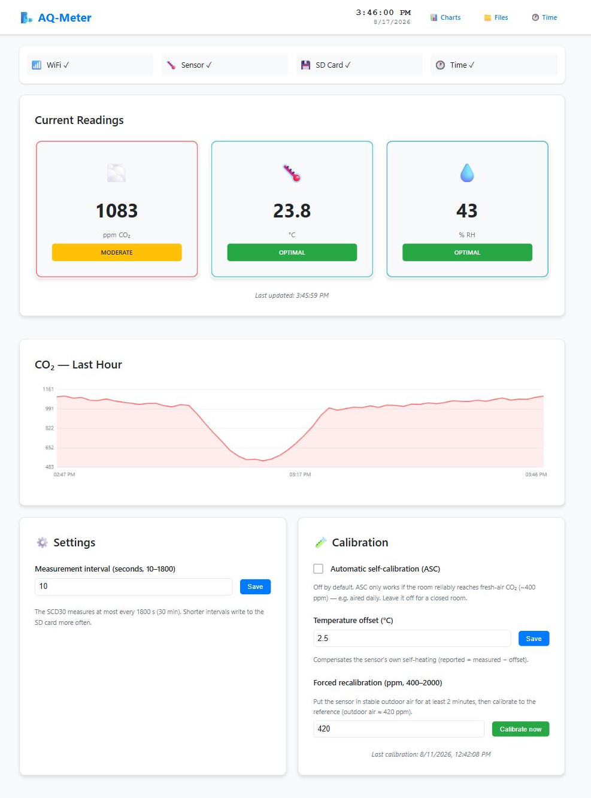
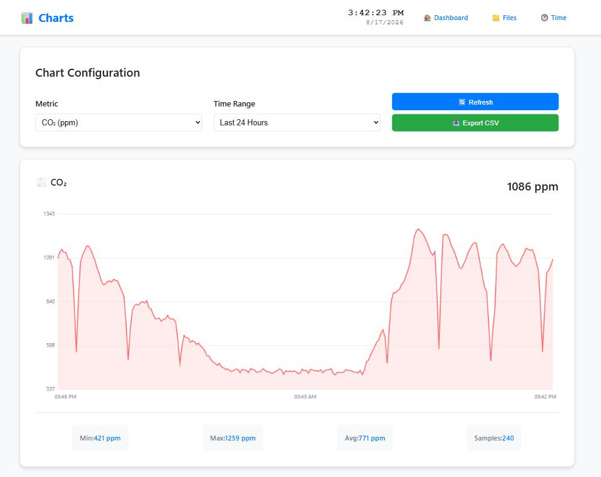
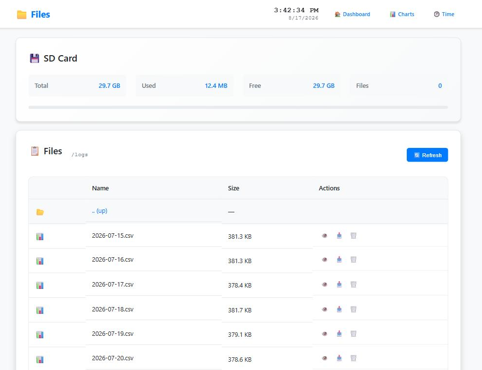
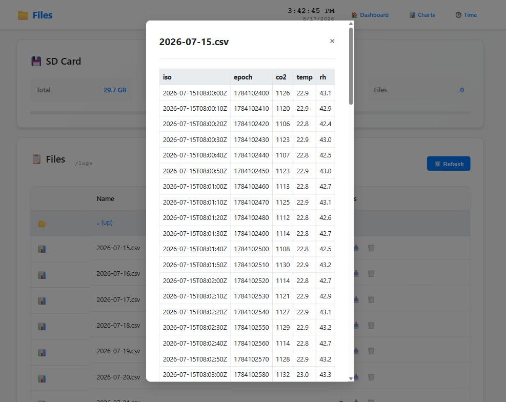
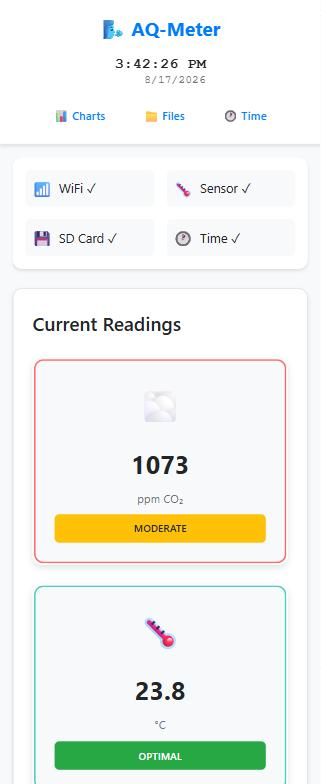
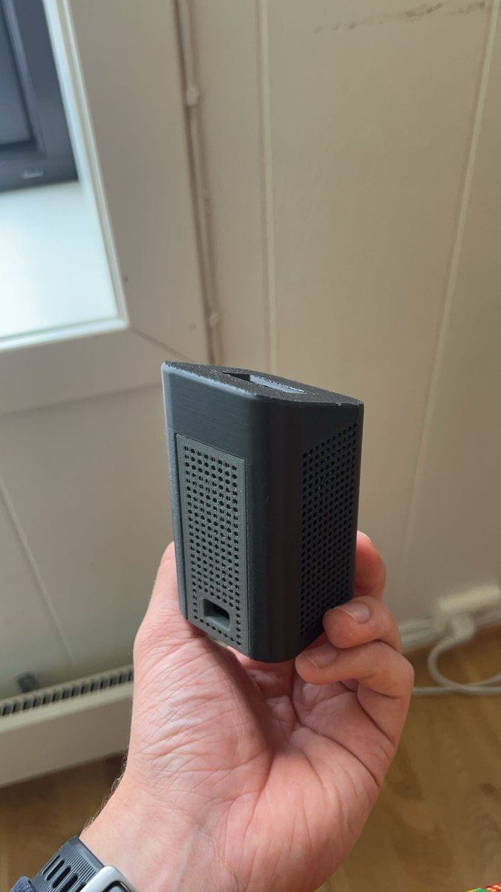
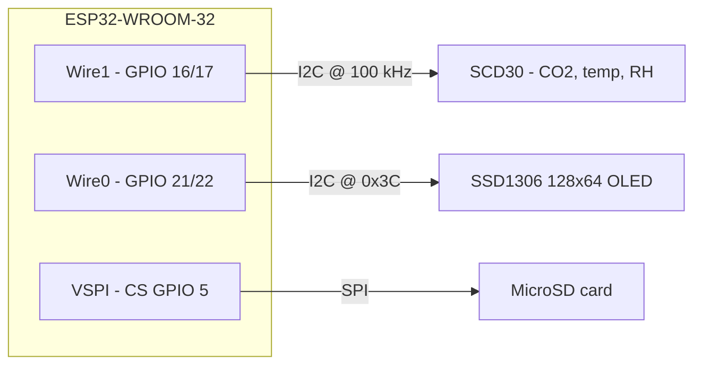
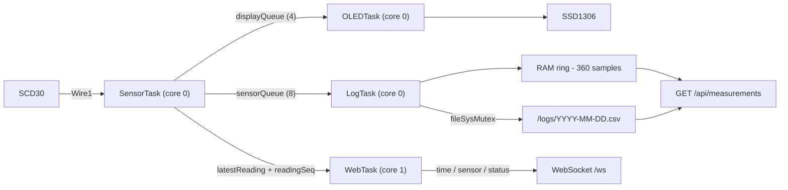

# Theia — ESP32 Air Quality Monitor

A self-contained CO₂ / temperature / humidity monitor built on an ESP32. It reads a
Sensirion **SCD30**, logs to a **MicroSD** card as daily CSV files, shows live values on an
**SSD1306 OLED**, and serves a web dashboard and JSON API from its **own WiFi access
point** — no router, no cloud, no internet.

[](https://github.com/bragesom/esp32-air-quality-monitor/actions/workflows/build.yml)
[](https://www.espressif.com/en/products/socs/esp32)
[](https://docs.platformio.org/en/latest/frameworks/arduino.html)
[](LICENSE)



> **About the screenshots:** the images in this README were rendered from the project's real
> `data/www` assets against a mock backend, using **simulated sensor values**. They show the
> actual UI, not readings from a live device.

---

## Overview

- **Measures** CO₂ (ppm), temperature and relative humidity with an SCD30 NDIR sensor, at a
  configurable 10 s – 30 min interval.
- **Logs autonomously** to `/logs/YYYY-MM-DD.csv` on a MicroSD card, with automatic
  retention pruning — no phone or laptop needs to be connected.
- **Survives reboots without an RTC** by persisting the wall clock to NVS.
- **Serves an offline web UI** over its own WiFi AP: live dashboard, history charts, an SD
  file browser, and a JSON API. Roughly **18 KB gzipped total**, with a hand-rolled canvas
  charting library — zero dependencies, zero CDN requests.
- **Runs four FreeRTOS tasks** pinned across both cores, with a deliberate single-writer
  discipline for every shared resource (I²C bus, WebSocket client list, NVS, SD card).
- **Calibrates on-device**: automatic self-calibration, forced recalibration, and a
  temperature offset for sensor self-heating.

---

## Gallery

| History charts | SD file browser |
|---|---|
|  |  |

A 24-hour CO₂ trace shows the pattern the device is built to reveal: a low overnight
baseline near outdoor air, a daytime rise from occupancy, and sharp drops each time the room
is aired.

| CSV preview, in the browser | Responsive layout |
|---|---|
|  |  |

<!-- Hardware photos: drop the files into docs/images/ and uncomment this block.

| The build | Assembled |
|---|---|
|  |  |

Suggested shots: the wired-up breadboard from above, a close-up of the OLED showing live
values, and the finished unit in its enclosure.
-->

---

## Hardware

### Bill of materials

| Component | Part used | Notes |
|---|---|---|
| MCU board | DOIT ESP32 DevKit v1 (ESP32-WROOM-32) | 4 MB flash. Any WROOM-32 board works — see the GPIO caveat below |
| CO₂ sensor | Sensirion **SCD30** | True NDIR, not an eCO₂ estimate. Peaks around 75 mA — give it a solid 3V3 supply |
| Display | **SSD1306** 128×64 OLED, I²C | Address `0x3C` |
| Storage | MicroSD breakout, SPI | FAT-formatted card |
| Misc | I²C pull-ups, common ground | Many breakout boards include pull-ups already |

### Wiring

| Signal | GPIO | Bus |
|---|---|---|
| SCD30 SDA / SCL | **16 / 17** | I²C bus 1 (`Wire1`), **100 kHz max** |
| OLED SDA / SCL | **21 / 22** | I²C bus 0 (`Wire0`), address `0x3C` |
| SD card CS | **5** | VSPI (SCK 18, MISO 19, MOSI 23) |



Pin definitions live in [`src/shared.h`](src/shared.h).

### Assembly notes

- **The SCD30 gets its own I²C bus.** It is clock-limited to 100 kHz, and giving it a
  dedicated bus keeps a slow sensor from throttling the display.
- **GPIO 16/17 are free on a WROOM-32 — but they are PSRAM on a WROVER.** Move the sensor
  bus if you use a WROVER module.
- **GPIO 5 is a boot-strapping pin.** Keep the SD module's CS pull-up; a card that holds
  the line low at reset can prevent boot.
- Both buses need pull-ups and a common ground with the sensor.

---

## Software

### Architecture

Four FreeRTOS tasks are pinned across both cores in [`src/main.cpp`](src/main.cpp):

| Task | Core | Stack | Prio | Cadence | Responsibility |
|---|---|---|---|---|---|
| `SensorTask` | 0 | 6 KB | 2 | 500 ms poll | Owns the SCD30 on `Wire1`; applies pending calibration, reads, dispatches |
| `LogTask` | 0 | 8 KB | 2 | queue-driven | Batches rows, writes daily CSVs, prunes retention, owns the RAM ring |
| `OLEDTask` | 0 | 4 KB | 1 | queue-driven | Redraws the SSD1306 on each new reading |
| `WebTask` | 1 | 8 KB | 3 | 200 ms | The only application task that touches the WebSocket client list |
| `loop()` | 1 | — | 1 | 100 ms | NVS persistence and heap reporting **only** |



[`src/shared.h`](src/shared.h) is the contract between tasks: the `SensorReading` struct,
pin definitions, queue and mutex externs, shared flags, and the ring API.

> **HTTP and WebSocket callbacks do not run on `WebTask`.** AsyncTCP owns its own task
> (`CONFIG_ASYNC_TCP_RUNNING_CORE`) and runs request and WS callbacks there. `WebTask`
> exists precisely so that exactly one application task ever mutates the client list —
> broadcasts and `cleanupClients()`. `loop()` performs no WebSocket work at all.

### Concurrency model

The design leans on **single ownership** rather than on locking everything:

- **The sensor task exclusively owns `Wire1`.** Web handlers that change calibration only
  set *pending flags*; the sensor task applies them over I²C on its next iteration. Nothing
  else ever touches the SCD30, so concurrent bus access is structurally impossible.
- **`WebTask` exclusively owns the WebSocket client list**, and **`loop()` exclusively owns
  NVS** — keeping flash writes single-threaded.
- **The SD card is mounted once** in `initSDCard()` and stays mounted; endpoints never call
  `SD.begin()` / `SD.end()`. All filesystem access is serialised by `fileSysMutex`.
- **File downloads stream long after the handler returns.** A download increments a
  *counter* (not a flag — concurrent downloads would clear each other's guard) while holding
  `fileSysMutex`. `flushLogBuffer()` takes that same mutex **first** and only then checks
  the counter, so there is no check-then-act window. The counter is decremented exactly once
  by a `shared_ptr` guard captured by both the body-filler and the `onDisconnect` handler,
  so it fires whether the stream completes or the client disappears.
- **Dropped samples are never silent.** If a queue or the log buffer overflows,
  `droppedSamples` increments and is surfaced as `dropped` in `/api/status` and the
  WebSocket `status` frame.

### Time and logging without an RTC

The board has no real-time clock. Instead, the wall clock is **persisted to NVS** and
restored at boot, so the device logs standalone across power cycles:

- On a **fresh device** (clock never set) logging is held until the time is known, so no
  bogus 1970 rows are ever written. Live readings, the OLED and the WebSocket are never
  gated.
- Any browser that opens the UI **auto-syncs** the clock via `POST /api/timeset`. After the
  first sync the time is saved and survives reboots.
- **The honest limitation:** without an RTC the clock cannot measure how long the device was
  powered *off*. After an unplugged gap it resumes from the last saved time until the next
  browser sync. Adding a DS3231 on the OLED bus would fix this.

### Storage and retention

Rows go to **daily files**, `/logs/YYYY-MM-DD.csv` (UTC roll), with the header
`iso,epoch,co2,temp,rh`:

```csv
iso,epoch,co2,temp,rh
2026-07-15T08:00:00Z,1784102400,1126,22.9,43.1
2026-07-15T08:00:10Z,1784102410,1120,22.9,42.9
2026-07-15T08:00:20Z,1784102420,1106,22.8,42.4
```

Writes are batched (16 rows, or every 60 s). The oldest day-files are pruned once either
`LOG_MAX_DAYS` (365) or `LOG_MAX_BYTES` (512 MB) is exceeded — at boot and on day-roll,
never per write, and never down to zero files.

*On card wear:* the SD card's own controller does wear-levelling and the host cannot direct
it. What the host **can** control is **write amplification**, so the design minimises it:
append-only files, batched writes, and deleting **whole** old files instead of rewriting a
ring in place — an in-place circular rewrite would keep hammering the same sectors.

### Measurement queries

`GET /api/measurements` resolves in two tiers, so the common case never touches the card:

1. **RAM ring (fast path).** `LogTask` keeps the 360 most recent samples in memory (~1 h at
   a 10 s interval). If the requested range starts at or after the oldest sample held, the
   ring fully covers it and the response is served without any SD access —
   `"source": "ram"`. This is what the dashboard and "Last Hour" chart hit.
2. **SD day-file scan.** Otherwise only the day files intersecting the range are opened,
   with `fileSysMutex` released **between files** so the log task isn't starved —
   `"source": "sd"`.

Both paths **decimate** down to at most 240 points. The SD scan does it in a single pass:
take every *stride*-th row, and when the output buffer fills, keep every other point already
collected and double the stride. Memory stays bounded over an arbitrarily long range.

### Calibration

Exposed under **Calibration** on the dashboard, and persisted to NVS:

- **ASC (automatic self-calibration)** — **off by default.** It assumes the room reliably
  reaches fresh-air CO₂ (~400 ppm); in a closed room that assumption drifts the baseline.
- **Forced recalibration (FRC)** — one-shot. Leave the sensor in stable outdoor air for at
  least 2 minutes, then calibrate to the reference (~420 ppm).
- **Temperature offset** — compensates the sensor's own self-heating.

All SCD30 writes happen on the sensor task; the web handler only raises flags.

---

## Web UI

Offline-first by necessity — the device is its own AP with no internet route, so nothing may
load from a CDN. Pages under [`data/www/`](data/www):

| Page | Contents |
|---|---|
| `index.html` | Dashboard — live readings, CO₂ mini-chart, Settings and Calibration cards |
| `chart.html` | History charts — metric and range selectors, min/max/avg stats, CSV export |
| `files.html` | SD browser — directory navigation, preview, download, delete (no upload) |
| `clock.html` | Manual clock re-sync |

Shared: `common.js` (WebSocket client, device clock, auto time-sync, status indicators),
`chart-lite.js` (a ~100-line canvas line chart with HiDPI support), `style.css`. Per-page:
`dashboard.js`, `charts.js`, `files.js`.

`compress_web_files.py` runs as a PlatformIO `pre:` hook and gzips everything in `data/www/`
on each build; `serveStatic` prefers the `.gz`. **Edit the source files, never the `.gz`** —
they are generated and gitignored. When adding a web file, add its name to
`FILES_TO_COMPRESS` in that script.

---

## HTTP / WebSocket API

Registered in [`src/web/endpoints.cpp`](src/web/endpoints.cpp).

| Route | Purpose |
|---|---|
| `POST /api/timeset` | Set the clock. JSON body `{"timestamp": <epoch>}` (or `epoch`) |
| `GET /api/status` | `timeIsSet`, `uptime`, `freeHeap`, `wsClients`, `measureInterval`, `dropped`, and sensor/sd/oled/wifi flags |
| `GET`/`POST` `/api/settings` | Get or set the measurement interval (**10–1800 s**; form param `interval`) |
| `GET`/`POST` `/api/calibration` | Get state, or set `asc` (0/1), `frc` (400–2000 ppm, one-shot), `tempOffset` (°C, clamped 0–20) |
| `GET /api/measurements` | `?from&to&limit` — latest reading when `limit<=1`, else a decimated range |
| `GET /api/fs/info` | SPIFFS and SD usage |
| `GET /api/fs/list` | `?path` — directory entries |
| `GET /api/fs/preview` | `?path&lines` — decoded text (default 40 lines, max 200) |
| `GET /api/fs/download` | `?path` — streams the file as an attachment |
| `DELETE /api/fs/delete` | `?path` |
| `WS /ws` | Live `time` / `sensor` / `status` frames, server → client only |

WebSocket frames (max 4 clients):

| Type | Cadence | Payload |
|---|---|---|
| `time` | ~1 s | `timestamp`, `uptime`, `interval` |
| `sensor` | per reading | `timestamp`, `co2`, `temp`, `rh` |
| `status` | 3 s | `sensor`, `sd`, `oled`, `wifi`, `timeIsSet`, `uptime`, `dropped` |

> ⚠️ **Units differ between the two transports.** The WebSocket `sensor` frame sends
> `temp` / `rh` as real floats (`23.4`). `GET /api/measurements` sends `temperature` /
> `humidity` as **0.1-unit integers** (`234`) under different field names. `co2` is plain
> ppm everywhere. This is the easiest thing to get wrong when writing a client.

---

## Getting started

**Prerequisites:** [PlatformIO Core](https://docs.platformio.org/en/latest/core/installation/)
(or the VS Code extension) and a USB cable. The toolchain and all libraries are pinned in
`platformio.ini` and fetched automatically on first build.

```bash
git clone https://github.com/bragesom/esp32-air-quality-monitor.git
cd esp32-air-quality-monitor

# 1. Set your access-point credentials (secrets.h is gitignored)
cp src/secrets.example.h src/secrets.h
#    then edit AP_PASS — WPA2 needs at least 8 characters

# 2. Build and flash
pio run                       # build firmware
pio run --target upload       # flash firmware over USB
pio run --target uploadfs     # flash SPIFFS (the web UI in data/www)
pio device monitor            # serial monitor @ 115200
```

**Firmware and filesystem must both be uploaded** after any web-asset change.
`upload_complete.ps1` (Windows) and `upload_complete.sh` (POSIX) do the whole sequence:
build → upload → uploadfs → monitor.

Then connect to the WiFi network (default SSID **`AQ-Meter-Pro`**, password from your
`secrets.h`) and open **<http://192.168.4.1>**. The clock syncs from your browser
automatically on first load.

---

## Repository layout

```
├── src/
│   ├── main.cpp              setup, WiFi AP, NVS, task launch, loop()
│   ├── shared.h              cross-task contract: struct, pins, queues, ring API
│   ├── secrets.example.h     credentials template (copy to secrets.h)
│   ├── tasks/
│   │   ├── sensor.cpp        SCD30 polling + calibration (owns Wire1)
│   │   ├── logging.cpp       daily CSV writes, retention, RAM ring
│   │   └── oled.cpp          SSD1306 rendering
│   └── web/
│       └── endpoints.cpp     all HTTP routes + the WebTask broadcast loop
├── data/www/                 offline web UI (uploaded to SPIFFS)
├── docs/images/              screenshots used by this README
├── compress_web_files.py     PlatformIO pre-hook: gzips data/www
├── partitions_3mb.csv        2 MB app + ~2 MB SPIFFS
└── platformio.ini            env esp32_3mb, pinned platform and libraries
```

---

## Design notes and limitations

Things worth knowing before building on this — stated plainly rather than left to be
discovered:

- **The OLED and the web UI disagree on CO₂ thresholds.** The OLED reports Good / OK / Poor
  at 800 / 1200 ppm; the web UI uses Excellent / Good / Moderate / Poor at 800 / 1000 /
  1500 ppm.
- **The OLED clock is hardcoded to UTC+2** with no DST handling. The web UI uses the
  browser's real locale, so the two can disagree by an hour.
- **`lastModified` in `/api/fs/list` is always `0`** — not implemented.
- **There is no OTA.** An `otadata` partition exists, but the table defines a single app
  slot, so updates are over USB.
- **CSV line endings are mixed:** the header is written with `println` (CRLF) while data
  rows use `printf` with `\n` (LF). Parsers handle it, but it is inconsistent.
- **No unit tests.** `test/` is an empty PlatformIO scaffold. The concurrency-sensitive
  parts — the stream-counter guard, ring decimation — are the places that would most repay
  a harness.
- **Retention is bounded but not enforced live.** Pruning runs at boot and on day-roll, so a
  single very long-running day could exceed the byte cap until the next roll.

Build flags in `platformio.ini` disable ArduinoJson doubles, 64-bit integers and Unicode
decoding, and the SSD1306 splash screen, to save flash. Don't reintroduce those casually.

---

## License

[MIT](LICENSE) © 2026 Brage S
